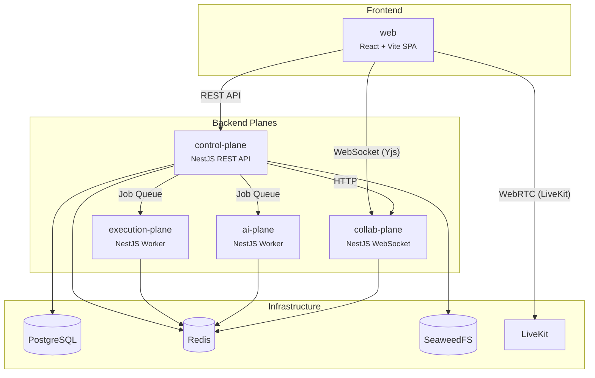

# SynCode

> **[中文版](README.zh.md)**

A collaborative technical interview training platform where CS students practice coding interviews together — real-time collaborative editing, sandboxed code execution, AI-powered feedback, and session replay.

[](https://github.com/JosephJoshua/syncode/actions/workflows/ci.yml)
[](LICENSE)

## Architecture Overview

SynCode is split into four independent **planes**, each responsible for a distinct concern. They communicate via message queues (BullMQ/Redis) and internal HTTP calls.



## Tech Stack

| Layer | Technologies |
|---|---|
| **Frontend** | React 19, Vite, TanStack Router + Query, Zustand, Tailwind CSS v4, shadcn/ui |
| **Backend** | NestJS, Drizzle ORM, Passport + JWT, BullMQ, Zod |
| **Database** | PostgreSQL 17, Redis 7 |
| **Infrastructure** | Docker, Caddy 2 (SSL), Nginx (routing), SeaweedFS (S3 storage), LiveKit (WebRTC) |
| **Tooling** | Turborepo, pnpm, Biome 2.x, Vitest, Playwright, GitHub Actions |
| **Observability** | OpenTelemetry, Prometheus, Loki, Tempo, Grafana |

## Quick Start

**Prerequisites:** Node.js 18+, pnpm 9+, Docker

```bash
git clone https://github.com/JosephJoshua/syncode.git
cd syncode
pnpm install
cp .env.example .env        # Edit as needed (defaults work for local dev)
pnpm infra:up               # Start PostgreSQL + Redis
pnpm db:migrate             # Run database migrations
pnpm dev                    # Start all apps in dev mode
```

Open [localhost:5173](http://localhost:5173) (web) and [localhost:3000/api](http://localhost:3000/api) (Swagger docs).

See [docs/getting-started.md](docs/getting-started.md) for a detailed setup guide.

## Project Structure

```
apps/
  web/                React SPA (frontend)
  control-plane/      REST API, auth, business logic
  collab-plane/       WebSocket server (Yjs collaborative editing)
  execution-plane/    Sandboxed code execution worker
  ai-plane/           AI feedback worker

packages/
  contracts/          Typed inter-plane contracts, route definitions, stubs
  db/                 Drizzle ORM schema + migrations
  infrastructure/     Adapter implementations (Redis, BullMQ, S3, LiveKit) + circuit breaker
  shared/             Port interfaces, DI tokens, types, constants
  tsconfig/           Shared TypeScript configurations
  ui/                 Shared React components (shadcn/ui)

infra/
  caddy/              Caddy reverse proxy (SSL termination)
  docker/             Multi-stage Dockerfiles
  nginx/              Nginx internal routing
  grafana/            Dashboard provisioning
  otel/               OpenTelemetry Collector config
  prometheus/         Prometheus config + alert rules
  loki/               Loki config
  tempo/              Tempo config
  scripts/            Deploy and maintenance scripts
```

## Documentation

- **[Getting Started](docs/getting-started.md)** — Detailed setup guide with beginner-friendly explanations
- **[Architecture](docs/architecture.md)** — Deep-dive into the multi-plane architecture, hexagonal pattern, and tech decisions
- **[Testing](docs/testing.md)** — Testing philosophy, best practices, and practical how-to guide
- **[Contributing](CONTRIBUTING.md)** — Git conventions, branch naming, commit format, PR workflow

## Contributing

See [CONTRIBUTING.md](CONTRIBUTING.md) for branch naming, commit message format, and PR workflow. All conventions are enforced by git hooks and CI.

## License

[Apache License 2.0](LICENSE)
