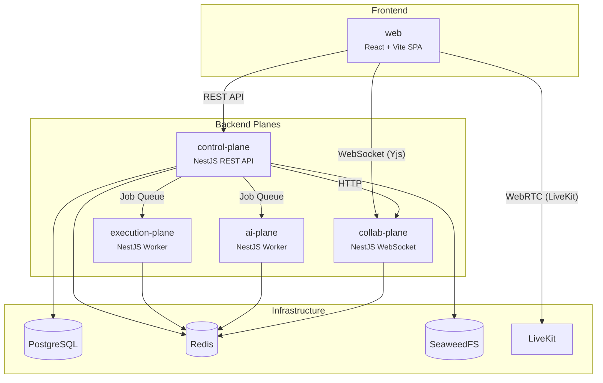

# SynCode

> **[English](README.md)**

面向计算机专业学生的协作式技术面试训练平台，支持实时协同编辑、沙箱代码执行、AI 反馈和会话回放，帮助用户组队练习编程面试。

[](https://github.com/JosephJoshua/syncode/actions/workflows/ci.yml)
[](LICENSE)

## 架构概览

SynCode 由四个独立的平面 (plane) 组成，各自负责不同的职责，通过消息队列 (BullMQ/Redis) 和内部 HTTP 调用进行通信。



## 技术栈

| 层级 | 技术选型 |
|---|---|
| **前端** | React 19, Vite, TanStack Router + Query, Zustand, Tailwind CSS v4, shadcn/ui |
| **后端** | NestJS, Drizzle ORM, Passport + JWT, BullMQ, Zod |
| **数据库** | PostgreSQL 17, Redis 7 |
| **基础设施** | Docker, Caddy 2 (SSL), Nginx (路由), SeaweedFS (S3 存储), LiveKit (WebRTC) |
| **工具链** | Turborepo, pnpm, Biome 2.x, Vitest, Playwright, GitHub Actions |
| **可观测性** | OpenTelemetry, Prometheus, Loki, Tempo, Grafana |

## 快速开始

**前置要求：** Node.js 18+、pnpm 9+、Docker

```bash
git clone https://github.com/JosephJoshua/syncode.git
cd syncode
pnpm install
cp .env.example .env        # Edit as needed (defaults work for local dev)
pnpm infra:up               # Start PostgreSQL + Redis
pnpm db:migrate             # Run database migrations
pnpm dev                    # Start all apps in dev mode
```

打开 [localhost:5173](http://localhost:5173) 访问前端页面，打开 [localhost:3000/api](http://localhost:3000/api) 查看 Swagger 文档。

详细的搭建指南请参阅 [docs/getting-started.zh.md](docs/getting-started.zh.md)。

## 项目结构

```
apps/
  web/                React SPA (frontend)
  control-plane/      REST API, auth, business logic
  collab-plane/       WebSocket server (Yjs collaborative editing)
  execution-plane/    Sandboxed code execution worker
  ai-plane/           AI feedback worker

packages/
  contracts/          Typed inter-plane contracts, route definitions, stubs
  db/                 Drizzle ORM schema + migrations
  infrastructure/     Adapter implementations (Redis, BullMQ, S3, LiveKit) + circuit breaker
  shared/             Port interfaces, DI tokens, types, constants
  tsconfig/           Shared TypeScript configurations
  ui/                 Shared React components (shadcn/ui)

infra/
  caddy/              Caddy reverse proxy (SSL termination)
  docker/             Multi-stage Dockerfiles
  nginx/              Nginx internal routing
  grafana/            Dashboard provisioning
  otel/               OpenTelemetry Collector config
  prometheus/         Prometheus config + alert rules
  loki/               Loki config
  tempo/              Tempo config
  scripts/            Deploy and maintenance scripts
```

## 文档

- **[快速开始](docs/getting-started.zh.md)** - 面向新手的详细搭建指南
- **[架构设计](docs/architecture.zh.md)** - 多平面架构、六边形模式和技术决策的深入解读
- **[测试指南](docs/testing.zh.md)** - 测试理念、最佳实践与实操指南
- **[贡献指南](CONTRIBUTING.zh.md)** - Git 规范、分支命名、提交格式、PR 流程

## 参与贡献

分支命名、提交信息格式和 PR 流程等规范详见 [CONTRIBUTING.zh.md](CONTRIBUTING.zh.md)。所有规范均通过 git hooks 和 CI 强制执行。

## 许可证

[Apache License 2.0](LICENSE)
