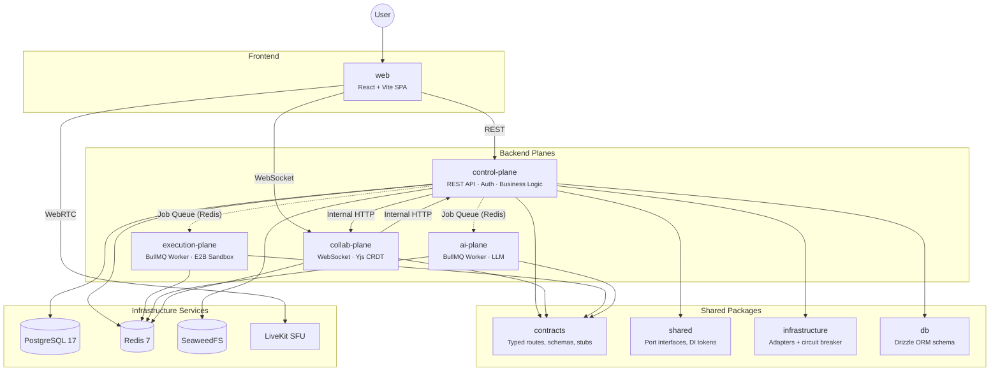
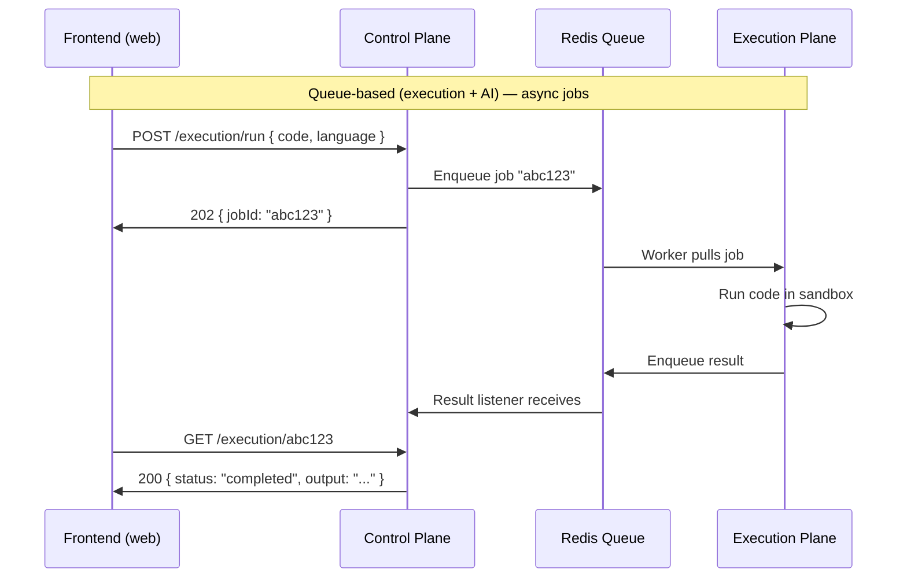
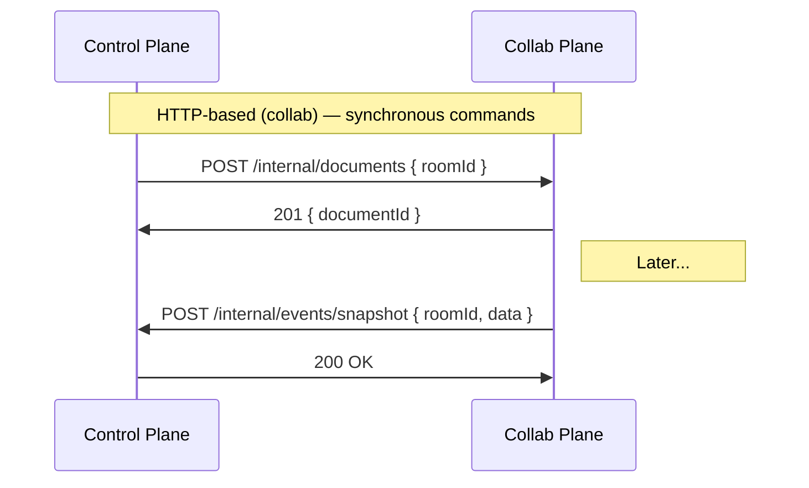
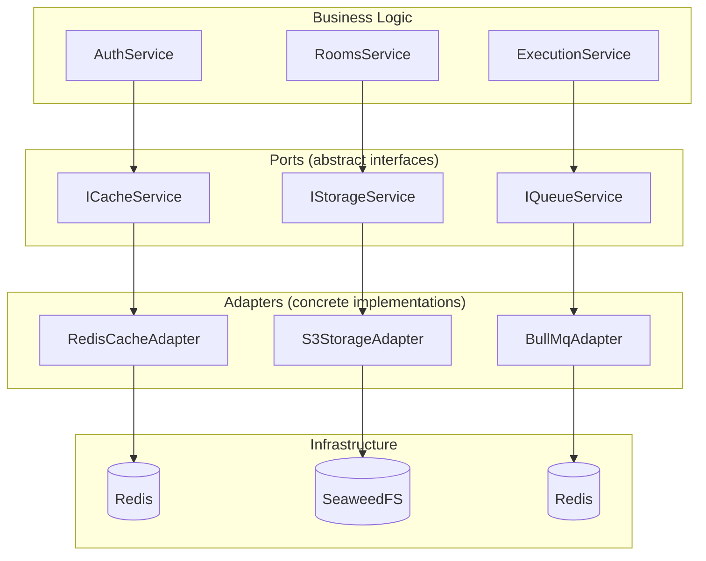
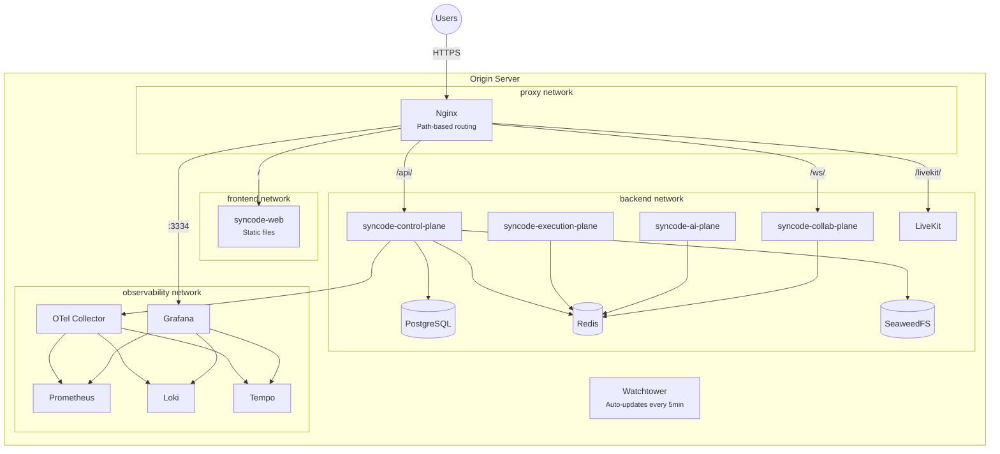
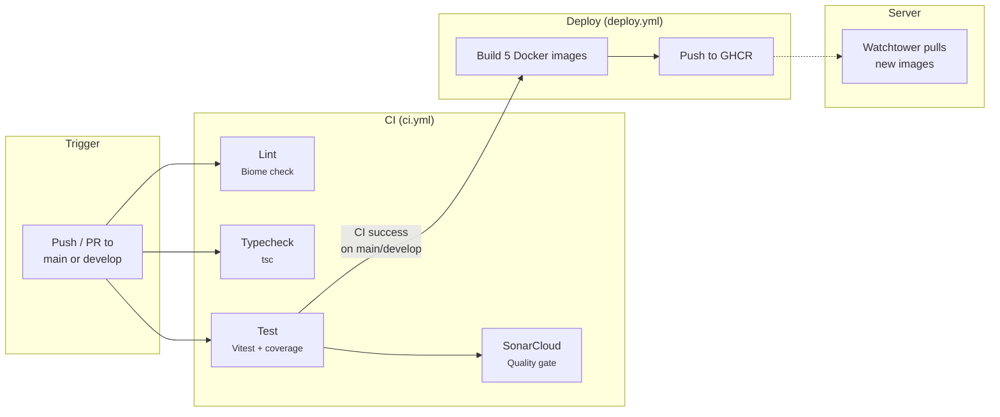

# Architecture

> **[中文版](architecture.zh.md)**

## The Big Picture

SynCode is built as four independent **planes** — each one a separate NestJS application with a distinct responsibility. They share code through internal packages but run as separate processes (and separate Docker containers in production).



When a user opens SynCode, their browser loads the React SPA (`web`). The SPA talks to the control-plane over REST for things like authentication, room management, and code execution. When the user joins a room, a WebSocket connection opens to the collab-plane for real-time collaborative editing. If the user runs code, the control-plane enqueues a job for the execution-plane. If they request AI feedback, a job goes to the ai-plane.

## The Four Planes

### Control Plane

`apps/control-plane/` — the "brain" of SynCode.

Handles authentication (JWT), room lifecycle, user management, problem CRUD, and code execution orchestration. It's a standard NestJS REST API.

- **Entry point:** `src/main.ts`
- **Modules:** `src/modules/` — `auth`, `rooms`, `users`, `problems`, `execution`, `internal`, `db`
- **Infrastructure wiring:** `src/infrastructure/infrastructure.module.ts` (the single file that binds all adapters to port tokens — more on this in [Hexagonal Architecture](#hexagonal-architecture-ports--adapters))
- **Swagger docs:** Available at `/api` when running

The control-plane is the only plane that talks directly to PostgreSQL. Other planes communicate with it via queues or internal HTTP.

### Collab Plane

`apps/collab-plane/` — real-time collaborative editing.

A WebSocket server that manages Yjs CRDT documents. When two users type in the same editor, their changes are synchronized through this plane. It also receives internal HTTP calls from the control-plane (e.g., "create a new document for room X") and sends events back (e.g., "snapshot ready").

- **Entry point:** `src/main.ts` (port 3001)
- **Protocol:** WebSocket (Yjs awareness + document updates)

### Execution Plane

`apps/execution-plane/` — sandboxed code execution.

A standalone NestJS worker — no HTTP server, no WebSocket. It pulls jobs from a BullMQ queue, runs user code inside an E2B sandbox (an isolated cloud environment), and pushes results back onto a return queue.

- **Entry point:** `src/main.ts`
- **Pattern:** BullMQ processor (queue consumer)

### AI Plane

`apps/ai-plane/` — AI-powered feedback.

Same architectural pattern as the execution plane: a standalone BullMQ worker. It processes AI-related jobs (hints, code review, interviewer responses) and returns results via a queue.

- **Entry point:** `src/main.ts`
- **Pattern:** BullMQ processor (queue consumer)

## How Planes Communicate

Planes use two communication patterns, chosen based on the nature of the interaction.

Queue-based:



HTTP-based:



### Why two patterns?

**Queues** (execution + AI): Code execution takes seconds to minutes. You can't hold an HTTP connection open that long. Queues decouple the request from the response — accept the job immediately, process it in the background, let the frontend poll for results. Queues also give you automatic retries if a worker crashes, dead letter queues for jobs that keep failing, and the ability to scale workers independently.

**HTTP** (collab): Document lifecycle commands (create/destroy) need confirmed delivery — you need to know right now if it worked. The collab plane is also always online when rooms are active, making direct HTTP reliable.

## Backend Architecture — NestJS and How It's Organized

If you've never seen NestJS, here's the short version.

### NestJS in 30 Seconds

[NestJS](https://docs.nestjs.com/) is a framework that structures your Node.js backend into **modules**. Each module groups related functionality. Inside a module you'll find:

- **Controllers** — handle HTTP requests (`@Get()`, `@Post()`, etc.)
- **Services** — contain business logic (the actual work)
- **DTOs** — define the shape of request/response data

This structure keeps large codebases organized. Instead of one giant `server.js`, each feature gets its own folder with clear boundaries.

### Dependency Injection (DI)

The most important NestJS concept for understanding this codebase.

Instead of hardcoding dependencies:

```typescript
// Bad — tightly coupled to Redis
import { RedisCache } from './redis-cache';

class AuthService {
  private cache = new RedisCache('redis://localhost:6379');
}
```

You declare what you *need* and NestJS provides it:

```typescript
// Good — depends on an interface, not a concrete implementation
class AuthService {
  constructor(@Inject(CACHE_SERVICE) private cache: ICacheService) {}
}
```

This means you can swap Redis for an in-memory cache without touching `AuthService`. The decision of *which* cache implementation to use lives in one place: `infrastructure.module.ts`.

### Module Structure

Each feature in `apps/control-plane/src/modules/` follows the same pattern. Taking `auth` as an example:

```
modules/auth/
  auth.controller.ts    — Routes: POST /auth/login, POST /auth/register, etc.
  auth.service.ts       — Business logic: validate credentials, generate tokens
  auth.module.ts        — Wires controller + service together
  jwt.strategy.ts       — Passport JWT validation strategy
  dto/                  — Request/response shapes for Swagger docs
```

Other modules (`rooms`, `users`, `problems`, `execution`, `internal`) follow the same layout.

### The Infrastructure Module

`apps/control-plane/src/infrastructure/infrastructure.module.ts` is the **single source of truth** for all adapter bindings. Every other module just says "give me a queue service" — this file decides which queue service they get.

It binds:
- `QUEUE_SERVICE` → `BullMqAdapter` (wrapped in circuit breaker)
- `CACHE_SERVICE` → `RedisCacheAdapter` (wrapped in circuit breaker)
- `STORAGE_SERVICE` → `S3StorageAdapter` (wrapped in circuit breaker)
- `MEDIA_SERVICE` → `LiveKitAdapter` (wrapped in circuit breaker)
- `EXECUTION_CLIENT` → `QueueExecutionClient` or `StubExecutionClient` (based on `USE_EXECUTION_STUB`)
- `AI_CLIENT` → `QueueAiClient` or `StubAiClient` (based on `USE_AI_STUB`)
- `COLLAB_CLIENT` → `HttpCollabClient` or `StubCollabClient` (based on `USE_COLLAB_STUB`)

To swap any infrastructure dependency, you change **one line** in this file. Zero changes to business logic.

## Why We Use These Technologies

### Why separate planes instead of one big server?

Each plane has different resource needs. Code execution is CPU-heavy and potentially dangerous (running untrusted code). The API needs to stay responsive. By separating them, a slow code execution doesn't block login requests. Each plane can also be scaled independently — need more execution capacity? Add more execution-plane workers without touching anything else.

### Why a message queue (BullMQ + Redis)?

Code execution takes seconds to minutes. You can't make a user wait with an open HTTP connection that long. Instead: accept the request immediately (return a `jobId`), hand the work to a background worker, let the user poll for results. Queues also give:

- **Automatic retries** if a worker crashes mid-job
- **Dead letter queues** for jobs that keep failing (so they don't block the queue)
- **Independent scaling** — add more workers without changing the API

### Why Redis?

Used for two things: as a **cache** (fast key-value lookups with TTL, like session tokens) and as the **backbone for BullMQ** queues. Redis stores data in memory, so reads and writes are extremely fast — microseconds instead of milliseconds.

### Why PostgreSQL?

The main database for permanent data: users, rooms, problems, execution results. It's a relational database — data lives in tables with relationships between them. We use [Drizzle ORM](https://orm.drizzle.team/) (`packages/db/`) to interact with it using TypeScript instead of raw SQL.

### Why SeaweedFS (S3-compatible storage)?

For files that don't belong in a database — session recordings, code snapshots, uploaded images. S3 is an industry-standard API for storing files (originally from Amazon). SeaweedFS implements the same S3 API but runs on our own server — no AWS account needed.

### Why WebSocket for collaboration?

HTTP is request/response: the client asks, the server answers. Real-time collaborative editing needs both sides to send messages at any time — when one user types, every other user must see the change instantly. WebSocket provides this persistent, bidirectional connection.

### Why Yjs (CRDT)?

When two users edit the same document simultaneously, their changes might conflict. [Yjs](https://docs.yjs.dev/) uses **CRDTs** (Conflict-free Replicated Data Types) to automatically merge edits without a central coordinator. Unlike git, there are no merge conflicts — concurrent edits are resolved deterministically. This is what powers Google Docs-style real-time collaboration.

### Why LiveKit?

[LiveKit](https://livekit.io/) is a WebRTC **SFU** (Selective Forwarding Unit) for audio and video. Instead of every participant sending video directly to every other participant (which scales terribly), everyone sends to the LiveKit server, which forwards efficiently. This keeps video calls performant even with many participants.

## Hexagonal Architecture (Ports and Adapters)

This is the key architectural pattern in SynCode. Understanding it makes the entire codebase click.

### The Core Idea

Business logic never directly talks to databases, queues, or storage. Instead, it talks to **abstract interfaces** called **ports**. Concrete implementations called **adapters** are plugged in at startup.



### Port Interfaces

Defined in `packages/shared/src/ports/`. Each one describes *what* you can do, not *how*:

| Port | Token | What It Does |
|---|---|---|
| `IQueueService` | `QUEUE_SERVICE` | Enqueue jobs, process jobs, manage dead letter queue |
| `ICacheService` | `CACHE_SERVICE` | Get/set/delete with TTL support |
| `IStorageService` | `STORAGE_SERVICE` | Upload/download/delete files (S3-compatible) |
| `IMediaService` | `MEDIA_SERVICE` | WebRTC room management (create/delete rooms, generate tokens) |
| `ISandboxProvider` | `SANDBOX_PROVIDER` | Execute code in an isolated environment (used by execution-plane only) |

### Adapter Implementations

Defined in `packages/infrastructure/src/`. Each one implements a port for a specific technology:

| Adapter | File | Implements |
|---|---|---|
| `BullMqAdapter` | `queue/bullmq.adapter.ts` | `IQueueService` |
| `RedisCacheAdapter` | `cache/redis-cache.adapter.ts` | `ICacheService` |
| `S3StorageAdapter` | `storage/s3-storage.adapter.ts` | `IStorageService` |
| `LiveKitAdapter` | `media/livekit.adapter.ts` | `IMediaService` |

### How It's Wired Together

In `apps/control-plane/src/infrastructure/infrastructure.module.ts`, each token is bound to an adapter:

```typescript
// Simplified — actual code uses factory functions for circuit breaker wrapping
{
  provide: CACHE_SERVICE,           // Token (what the app asks for)
  useFactory: (config) => {
    return new RedisCacheAdapter({   // Adapter (what it actually gets)
      url: config.get('REDIS_URL'),
    });
  },
}
```

To swap Redis for a different cache, you'd change `RedisCacheAdapter` to `MemoryCacheAdapter` here. Every service that injects `CACHE_SERVICE` keeps working without any changes.

### Contract Clients

Inter-plane communication also follows the port/adapter pattern. Defined in `packages/contracts/src/`:

| Client Interface | Token | What It Does |
|---|---|---|
| `IExecutionClient` | `EXECUTION_CLIENT` | Submit/poll/cancel code execution jobs |
| `IAiClient` | `AI_CLIENT` | Submit/poll AI requests |
| `ICollabClient` | `COLLAB_CLIENT` | HTTP calls to collab plane |

Each has a **stub** (`StubExecutionClient`, `StubAiClient`, `StubCollabClient`) enabled via `USE_*_STUB` env vars. Stubs simulate async processing with configurable delay and failure rates — perfect for developing without running all services.

### Why This Matters

This isn't architecture for architecture's sake. It directly enables:

1. **Easy testing** — inject mocks instead of real infrastructure (see [Testing](testing.md))
2. **Independent development** — work on the frontend with stubs, no need to run every service
3. **Technology swaps** — replace SeaweedFS with MinIO? Change one file. Replace BullMQ with RabbitMQ? Change one file.
4. **Circuit breaker protection** — each adapter is wrapped in a circuit breaker that prevents cascading failures

## Shared Packages

These packages are imported by multiple apps:

| Package | Path | Purpose |
|---|---|---|
| `@syncode/contracts` | `packages/contracts/` | Typed inter-plane contracts, route definitions, Zod schemas, stubs |
| `@syncode/shared` | `packages/shared/` | Port interfaces, DI tokens, types, constants, permissions |
| `@syncode/infrastructure` | `packages/infrastructure/` | Concrete adapter implementations + circuit breaker |
| `@syncode/db` | `packages/db/` | Drizzle ORM schema, migrations, client factory |
| `@syncode/ui` | `packages/ui/` | Shared React components ([shadcn/ui](https://ui.shadcn.com/)) |
| `@syncode/tsconfig` | `packages/tsconfig/` | Shared TypeScript configuration bases |

## Frontend Architecture

The frontend (`apps/web/`) is a React 19 SPA built with Vite. No server-side rendering — it's a single-page app that runs entirely in the browser.

### Key Libraries

**[TanStack Router](https://tanstack.com/router/latest)** — file-based routing. Add a file in `src/routes/`, get a route. The router generates type-safe route definitions automatically.

**[TanStack Query](https://tanstack.com/query/latest)** — manages **server state** (data from the API). It handles fetching, caching, background refetching, and stale data. This is different from **client state** (UI state like "is the sidebar open"), which uses Zustand.

**[Zustand](https://zustand.docs.pmnd.rs/)** — simple client state management. A store is just a function that returns state and actions. See `src/stores/` for examples.

**[shadcn/ui](https://ui.shadcn.com/)** — pre-built UI components (buttons, forms, modals, etc.) in `packages/ui/`. Unlike a typical library, shadcn/ui components are copied into your codebase — you own and customize them directly.

## How Frontend and Backend Stay in Sync — The Contracts Pattern

### The Problem

In a team, the backend dev adds a new field to an API response. The frontend dev doesn't know. Things break at runtime. Or: the frontend sends `userName` but the backend expects `username`. No error until someone actually tests it.

### The Solution

`packages/contracts/` contains **typed route definitions** and **Zod schemas** that both frontend and backend import. When the backend changes a schema, TypeScript immediately flags everywhere in the frontend that needs updating.

### How It Works End-to-End

**1. Define the schema** in `packages/contracts/src/control/auth.ts`:

```typescript
export const loginSchema = z.object({
  email: z.string().email(),
  password: z.string().min(8),
});
export type LoginInput = z.infer<typeof loginSchema>;
```

**2. Define the route** in `packages/contracts/src/control/routes.ts`:

```typescript
export const CONTROL_API = {
  AUTH: {
    LOGIN: defineRoute<LoginInput, AuthTokensResponse>()('auth/login', 'POST'),
    // ...
  },
};
```

The `defineRoute` function (in `packages/contracts/src/route-utils.ts`) creates a **phantom-typed** route object — it carries the request and response types at the TypeScript level without any runtime overhead.

**3. Backend controller** imports the schema for validation and the route for the path:

```typescript
@Post(CONTROL_API.AUTH.LOGIN.route)
async login(@Body() body: LoginInput) { /* ... */ }
```

**4. Frontend API helper** (`apps/web/src/lib/api-client.ts`) takes a route object and provides type-safe request/response:

```typescript
const tokens = await api(CONTROL_API.AUTH.LOGIN, {
  body: { email, password },
});
// TypeScript knows:
//   - body must be LoginInput
//   - tokens is AuthTokensResponse
//   - URL is 'auth/login' with POST method
```

### Why This Matters for a Team

Everyone works against the same contract. If someone changes the schema, TypeScript tells everyone who's affected — across frontend and backend — at compile time. No more "it works on my machine" bugs from mismatched API shapes.

## Environments

SynCode runs two deployed environments, both on the same server but as isolated Docker Compose projects:

| Environment | URL | Branch | Image Tag | When It Updates |
|---|---|---|---|---|
| **Production** | [syncode.anggita.org](https://syncode.anggita.org) | `main` | `latest` | When a PR is merged to `main` |
| **Staging** | [staging.syncode.anggita.org](https://staging.syncode.anggita.org) | `develop` | `develop` | When a PR is merged to `develop` |

**Monitoring dashboards:**

| Environment | Grafana URL |
|---|---|
| Production | [grafana.syncode.anggita.org](https://grafana.syncode.anggita.org) |
| Staging | [grafana.staging.syncode.anggita.org](https://grafana.staging.syncode.anggita.org) |

**How to use them:**
- Develop on a feature branch → PR to `develop` → merged → staging auto-updates within 5 minutes
- Once staging is verified → PR from `develop` to `main` → merged → production auto-updates
- Check Grafana dashboards for logs (Loki), metrics (Prometheus), and traces (Tempo) if something looks wrong

Both environments use the same `docker-compose.prod.yml` file, differentiated by environment variables (image tag, ports, Grafana subdomain) and Docker Compose project name (`syncode` vs `syncode-staging`).

## Deployment Architecture



Nginx routes requests by path:

| Path | Upstream | Protocol |
|---|---|---|
| `/` | `web:80` | HTTP (static files) |
| `/api/*` | `control-plane:3000` | HTTP (REST API) |
| `/ws/*` | `collab-plane:3001` | WebSocket (Yjs CRDT) |
| `/livekit/*` | `livekit:7880` | WebSocket (WebRTC signaling) |
| Port 3334 | `grafana:3000` | HTTP (Grafana dashboard) |

**Docker networks** isolate concerns: `proxy` (Nginx ↔ app planes), `frontend` (Nginx ↔ web), `backend` (all planes + databases), `observability` (monitoring stack). Data services (PostgreSQL, Redis, SeaweedFS) are only on the `backend` network — not reachable from the proxy layer.

**Watchtower** polls GHCR every 5 minutes and automatically restarts containers when new images are available (only containers labeled `watchtower.enable=true`).

**Container images** are built by CI and pushed to `ghcr.io/josephjoshua/syncode-*` with tags `latest` (main branch), `develop` (develop branch), and `sha-<short>` (every build).

## CI/CD Pipeline



**CI** (`ci.yml`): Runs on every push and PR to main/develop. Three parallel jobs — lint, typecheck, test — followed by SonarCloud analysis. Uses Node.js 25.

**Deploy** (`deploy.yml`): Triggered when CI succeeds on main or develop. Builds five Docker images (one per app) using multi-stage Dockerfiles in `infra/docker/`, pushes to GHCR. Images are tagged based on branch: `latest` for main, `develop` for the develop branch.

**Branch Protection** (`branch-protection.yml`): A server-side backstop that rejects any direct push to main or develop — only PR merges (via GitHub's `web-flow` user) are allowed.
