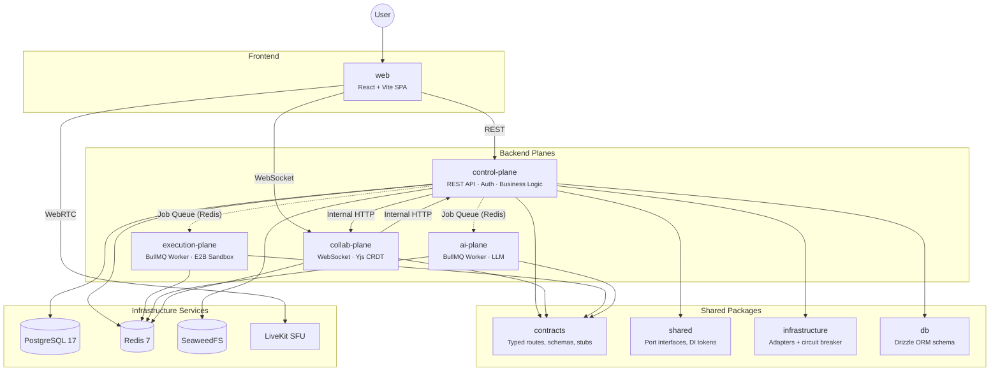
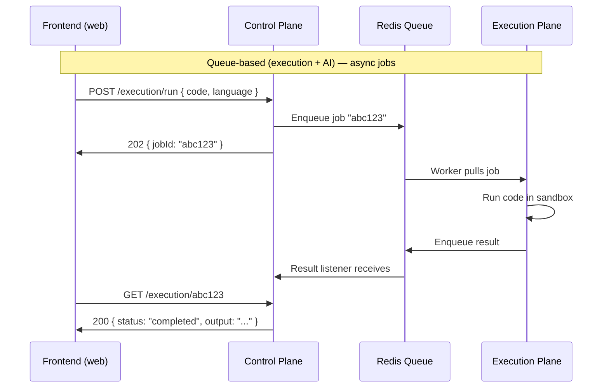
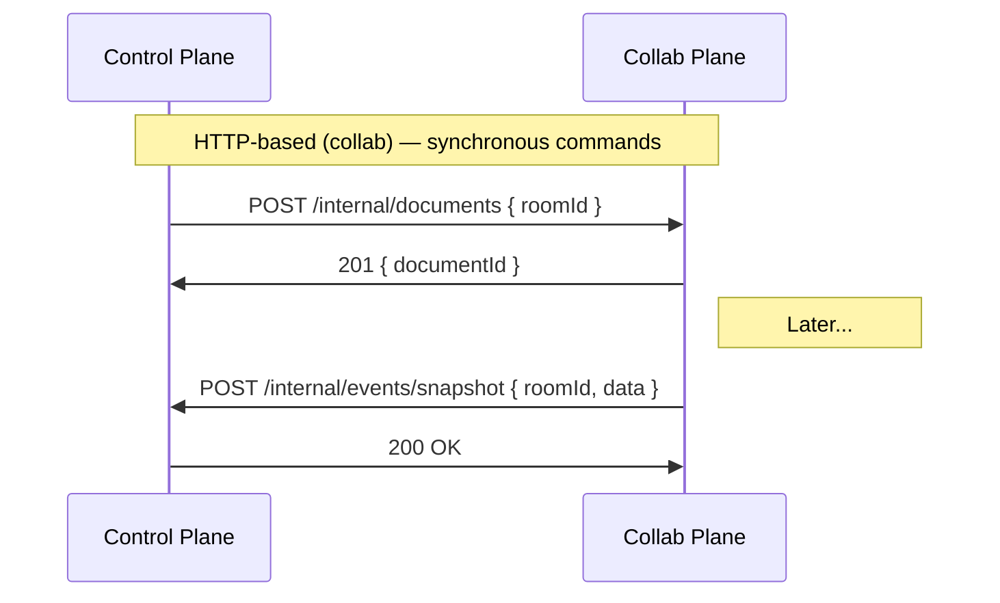
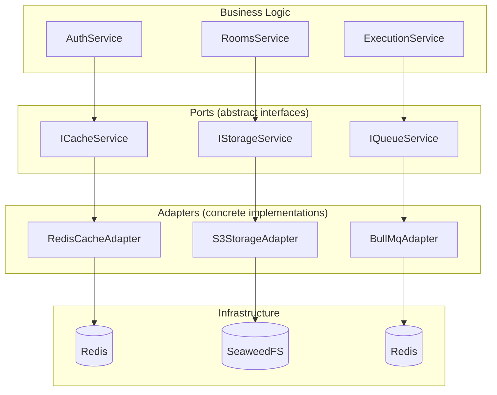
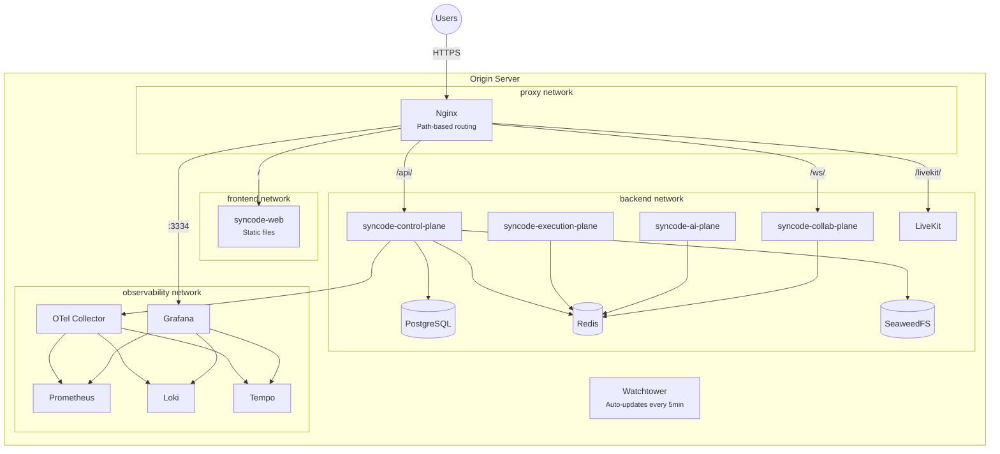
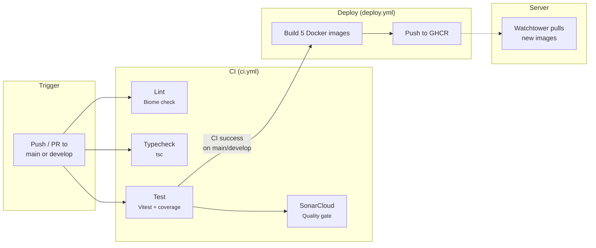

# 系统架构

> **[English](architecture.md)**

## 全局视角

SynCode 由四个独立的 **plane** 组成，每个 plane 是一个独立的 NestJS 应用，承担不同的职责。它们通过内部共享包复用代码，但各自作为独立进程运行，在生产环境中也部署在独立的 Docker 容器中。



用户打开 SynCode 时，浏览器会加载 React SPA (`web`)。SPA 通过 REST 与 control-plane 通信，处理认证、房间管理、代码执行等请求。用户加入房间后，会与 collab-plane 建立 WebSocket 连接，实现实时协作编辑。用户运行代码时，control-plane 会将任务入队交给 execution-plane 处理；请求 AI 反馈时，任务则发送给 ai-plane。

## 四个 Plane

### Control Plane

`apps/control-plane/` 是 SynCode 的核心枢纽。

负责认证 (JWT)、房间生命周期管理、用户管理、题目 CRUD 以及代码执行编排，本质上是一个标准的 NestJS REST API。

- **入口文件：** `src/main.ts`
- **模块划分：** `src/modules/` 包含 `auth`、`rooms`、`users`、`problems`、`execution`、`internal`、`db`
- **基础设施绑定：** `src/infrastructure/infrastructure.module.ts`（所有适配器与端口令牌的绑定集中在此文件，详见[六边形架构](#六边形架构端口与适配器)）
- **Swagger 文档：** 运行时可通过 `/api` 访问

Control-plane 是唯一直接访问 PostgreSQL 的 plane，其他 plane 通过队列或内部 HTTP 与其通信。

### Collab Plane

`apps/collab-plane/` 负责实时协作编辑。

这是一个 WebSocket 服务器，管理 Yjs CRDT 文档。当两个用户在同一个编辑器中输入时，他们的修改通过这个 plane 同步。它还接收来自 control-plane 的内部 HTTP 调用（如"为房间 X 创建新文档"），并向 control-plane 发送事件（如"快照已就绪"）。

- **入口文件：** `src/main.ts`（端口 3001）
- **协议：** WebSocket（Yjs awareness + 文档更新）

### Execution Plane

`apps/execution-plane/` 负责沙箱化代码执行。

这是一个独立的 NestJS Worker，不启动 HTTP 服务，也不开 WebSocket。它从 BullMQ 队列中拉取任务，在 E2B 沙箱（隔离的云端环境）中运行用户代码，然后将结果推回返回队列。

- **入口文件：** `src/main.ts`
- **模式：** BullMQ processor（队列消费者）

### AI Plane

`apps/ai-plane/` 负责 AI 驱动的反馈功能。

架构模式与 execution plane 相同：一个独立的 BullMQ Worker。它处理 AI 相关任务（提示、代码审查、面试官回复），并通过队列返回结果。

- **入口文件：** `src/main.ts`
- **模式：** BullMQ processor（队列消费者）

## Plane 间通信

Plane 之间根据交互性质选择不同的通信模式。

基于队列的通信：



基于 HTTP 的通信：



### 为什么采用两种模式？

**队列**（execution + AI）：代码执行耗时从几秒到几分钟不等，无法让 HTTP 连接一直保持打开。队列将请求和响应解耦：立即接受任务，后台异步处理，前端轮询获取结果。队列还提供了 Worker 崩溃后的自动重试、持续失败任务的死信队列，以及独立扩展 Worker 的能力。

**HTTP**（collab）：文档生命周期操作（创建/销毁）需要确认送达，必须立即知道操作是否成功。而且在房间活跃期间 collab-plane 始终在线，直接 HTTP 调用足够可靠。

## 后端架构：NestJS 及其组织方式

如果你之前没用过 NestJS，这里简单介绍一下。

### 30 秒了解 NestJS

[NestJS](https://docs.nestjs.com/) 是一个结构化的 Node.js 后端框架，按**模块**来组织代码，每个模块封装一组相关功能。模块内部通常包含：

- **Controller** 处理 HTTP 请求（`@Get()`、`@Post()` 等）
- **Service** 包含业务逻辑（实际的处理工作）
- **DTO** 定义请求/响应的数据结构

这样大型代码库就不会乱成一团。不用把所有逻辑塞进一个 `server.js`，每个功能有自己的目录，边界清晰。

### 依赖注入 (DI)

这是理解本项目代码库最关键的 NestJS 概念。

比起直接硬编码依赖：

```typescript
// Bad — tightly coupled to Redis
import { RedisCache } from './redis-cache';

class AuthService {
  private cache = new RedisCache('redis://localhost:6379');
}
```

更好的做法是声明你需要什么，让 NestJS 帮你注入：

```typescript
// Good — depends on an interface, not a concrete implementation
class AuthService {
  constructor(@Inject(CACHE_SERVICE) private cache: ICacheService) {}
}
```

这样就可以在不修改 `AuthService` 的情况下把 Redis 换成内存缓存。至于具体使用哪种缓存实现，决策集中在一个地方：`infrastructure.module.ts`。

### 模块结构

`apps/control-plane/src/modules/` 中的每个功能模块都遵循相同的模式。以 `auth` 为例：

```
modules/auth/
  auth.controller.ts    — Routes: POST /auth/login, POST /auth/register, etc.
  auth.service.ts       — Business logic: validate credentials, generate tokens
  auth.module.ts        — Wires controller + service together
  jwt.strategy.ts       — Passport JWT validation strategy
  dto/                  — Request/response shapes for Swagger docs
```

其他模块（`rooms`、`users`、`problems`、`execution`、`internal`）也采用同样的布局。

### Infrastructure Module

`apps/control-plane/src/infrastructure/infrastructure.module.ts` 集中管理着所有适配器的绑定关系。其他模块只需声明"给我一个队列服务"，至于实际注入哪个实现，全由这个文件决定。

它负责绑定以下内容：
- `QUEUE_SERVICE` → `BullMqAdapter`（包裹了断路器）
- `CACHE_SERVICE` → `RedisCacheAdapter`（包裹了断路器）
- `STORAGE_SERVICE` → `S3StorageAdapter`（包裹了断路器）
- `MEDIA_SERVICE` → `LiveKitAdapter`（包裹了断路器）
- `EXECUTION_CLIENT` → `QueueExecutionClient` 或 `StubExecutionClient`（取决于 `USE_EXECUTION_STUB`）
- `AI_CLIENT` → `QueueAiClient` 或 `StubAiClient`（取决于 `USE_AI_STUB`）
- `COLLAB_CLIENT` → `HttpCollabClient` 或 `StubCollabClient`（取决于 `USE_COLLAB_STUB`）

要替换任何基础设施依赖，只需修改这个文件中的一行代码，业务逻辑完全不需要改动。

## 技术选型理由

### 为什么拆分成多个 plane 而不是做成单体？

每个 plane 对资源的需求差别很大。代码执行是 CPU 密集型的，而且要运行不可信代码，有安全风险。API 需要保持快速响应。拆开之后，一个耗时很长的代码执行不会把登录请求卡住。而且每个 plane 可以独立扩展：需要更多执行能力？直接加 execution-plane 的 Worker 数量就行，其他服务完全不用动。

### 为什么使用消息队列 (BullMQ + Redis)？

代码执行可能需要几秒到几分钟，不可能让用户一直等着 HTTP 连接。正确的做法是：立刻接受请求（返回一个 `jobId`），把活儿交给后台 Worker，让用户轮询结果。除此之外，队列还提供了：

- **自动重试**：Worker 在处理任务中途崩溃时可自动重试
- **死信队列**：反复失败的任务会进入死信队列，不会阻塞正常任务
- **独立扩展**：增加 Worker 无需修改 API

### 为什么使用 Redis？

Redis 在项目里干两件事：一是当**缓存**用（带过期时间的键值查询，比如会话令牌），二是给 **BullMQ** 当底层存储。Redis 把数据放在内存里，读写极快，延迟在微秒级。

### 为什么使用 PostgreSQL？

PostgreSQL 是存持久化数据的主数据库，存用户、房间、题目、执行结果这些。它是关系型数据库，数据放在有关联关系的表里。我们用 [Drizzle ORM](https://orm.drizzle.team/)（`packages/db/`）来操作数据库，写 TypeScript 而不是裸 SQL。

### 为什么使用 SeaweedFS（S3 兼容存储）？

有些文件不适合往数据库里塞，比如会话录制、代码快照、上传的图片。S3 是文件存储的行业标准接口，最早是 Amazon 搞出来的。SeaweedFS 兼容 S3 的 API，但跑在我们自己的服务器上，不需要 AWS 账号。

### 为什么用 WebSocket 做协作？

HTTP 是请求/响应模式，客户端问一句服务端答一句。但实时协作编辑需要双方随时都能发消息：一个用户打字，其他人必须立刻看到。WebSocket 提供的就是这种持久的双向连接。

### 为什么使用 Yjs (CRDT)？

两个用户同时编辑同一份文档，改动难免冲突。[Yjs](https://docs.yjs.dev/) 用 **CRDT**（无冲突复制数据类型）来自动合并编辑，不需要中心协调者。跟 git 不一样，CRDT 没有合并冲突的概念，并发编辑会被确定性地解决。Google Docs 的实时协作就是靠这个技术实现的。

### 为什么使用 LiveKit？

[LiveKit](https://livekit.io/) 是一个 WebRTC **SFU**（选择性转发单元），用来做音视频通信。如果每个人都直接把视频发给其他所有人，人一多就撑不住。LiveKit 让所有人把流发到服务器，由服务器高效转发，这样即使参与者多了，通话也不会卡。

## 六边形架构（端口与适配器）

这是 SynCode 最核心的架构模式。搞懂了它，整个代码库的设计逻辑就通了。

### 核心思想

业务逻辑不直接跟数据库、队列、存储打交道，而是通过**端口（Port）**这层抽象接口来交互。具体的实现叫**适配器（Adapter）**，在应用启动时注入进去。



### 端口接口

定义在 `packages/shared/src/ports/` 中。每个接口描述的是"能做什么"，而非"怎么做"：

| 端口 | 令牌 | 职责 |
|---|---|---|
| `IQueueService` | `QUEUE_SERVICE` | 任务入队、任务处理、死信队列管理 |
| `ICacheService` | `CACHE_SERVICE` | 支持 TTL 的 get/set/delete 操作 |
| `IStorageService` | `STORAGE_SERVICE` | 文件上传/下载/删除（S3 兼容） |
| `IMediaService` | `MEDIA_SERVICE` | WebRTC 房间管理（创建/删除房间，生成令牌） |
| `ISandboxProvider` | `SANDBOX_PROVIDER` | 在隔离环境中执行代码（仅 execution-plane 使用） |

### 适配器实现

定义在 `packages/infrastructure/src/` 中。每个适配器为特定技术实现一个端口：

| 适配器 | 文件 | 实现的端口 |
|---|---|---|
| `BullMqAdapter` | `queue/bullmq.adapter.ts` | `IQueueService` |
| `RedisCacheAdapter` | `cache/redis-cache.adapter.ts` | `ICacheService` |
| `S3StorageAdapter` | `storage/s3-storage.adapter.ts` | `IStorageService` |
| `LiveKitAdapter` | `media/livekit.adapter.ts` | `IMediaService` |

### 绑定方式

在 `apps/control-plane/src/infrastructure/infrastructure.module.ts` 中，每个令牌绑定到对应的适配器：

```typescript
// Simplified — actual code uses factory functions for circuit breaker wrapping
{
  provide: CACHE_SERVICE,           // Token (what the app asks for)
  useFactory: (config) => {
    return new RedisCacheAdapter({   // Adapter (what it actually gets)
      url: config.get('REDIS_URL'),
    });
  },
}
```

如果要把 Redis 换成其他缓存实现，只需在这里把 `RedisCacheAdapter` 改为 `MemoryCacheAdapter`。所有注入了 `CACHE_SERVICE` 的服务无需任何修改即可正常工作。

### Contract Client

跨 plane 通信同样遵循端口/适配器模式。定义在 `packages/contracts/src/` 中：

| 客户端接口 | 令牌 | 职责 |
|---|---|---|
| `IExecutionClient` | `EXECUTION_CLIENT` | 提交/轮询/取消代码执行任务 |
| `IAiClient` | `AI_CLIENT` | 提交/轮询 AI 请求 |
| `ICollabClient` | `COLLAB_CLIENT` | 向 collab plane 发起 HTTP 调用 |

每个客户端都有对应的 **Stub** 实现（`StubExecutionClient`、`StubAiClient`、`StubCollabClient`），通过 `USE_*_STUB` 环境变量启用。Stub 模拟异步处理过程，支持配置延迟和失败率，非常适合在不启动所有服务的情况下进行开发。

### 为什么这种架构很重要

这不是为了好看才这么设计的，它实打实地带来了这些好处：

1. **易于测试**：注入 mock 对象代替真实基础设施（参见[测试](testing.zh.md)）
2. **独立开发**：使用 Stub 开发前端，无需启动所有服务
3. **技术替换**：把 SeaweedFS 换成 MinIO？改一个文件。把 BullMQ 换成 RabbitMQ？改一个文件
4. **断路器保护**：每个适配器都包裹了断路器，防止级联故障

## 共享包

以下包被多个应用引用：

| 包名 | 路径 | 用途 |
|---|---|---|
| `@syncode/contracts` | `packages/contracts/` | 跨 plane 的类型化契约、路由定义、Zod schema、Stub 实现 |
| `@syncode/shared` | `packages/shared/` | 端口接口、DI 令牌、类型定义、常量、权限 |
| `@syncode/infrastructure` | `packages/infrastructure/` | 具体适配器实现和断路器 |
| `@syncode/db` | `packages/db/` | Drizzle ORM schema、迁移文件、客户端工厂 |
| `@syncode/ui` | `packages/ui/` | 共享 React 组件（[shadcn/ui](https://ui.shadcn.com/)） |
| `@syncode/tsconfig` | `packages/tsconfig/` | 共享 TypeScript 配置基础 |

## 前端架构

前端 (`apps/web/`) 是基于 React 19 和 Vite 构建的 SPA，没有服务端渲染，完全在浏览器中运行。

### 核心库

**[TanStack Router](https://tanstack.com/router/latest)** 提供基于文件的路由。在 `src/routes/` 下添加文件就会自动生成路由，并且路由定义是类型安全的。

**[TanStack Query](https://tanstack.com/query/latest)** 管理 **服务端状态**（从 API 获取的数据），处理数据请求、缓存、后台刷新和过期数据。与之对应的 **客户端状态**（如"侧边栏是否展开"等 UI 状态）则使用 Zustand 管理。

**[Zustand](https://zustand.docs.pmnd.rs/)** 是一个简洁的客户端状态管理库。Store 就是一个返回状态和操作的函数，具体用法可参考 `src/stores/` 目录中的示例。

**[shadcn/ui](https://ui.shadcn.com/)** 提供预构建的 UI 组件（按钮、表单、弹窗等），存放在 `packages/ui/` 中。与传统组件库不同，shadcn/ui 的组件是直接复制到你的代码库中的，你可以完全拥有并自由定制它们。

## 前后端如何保持同步：Contract 模式

### 问题

在团队协作中，后端开发者在 API 响应中新增了一个字段，前端开发者并不知道，结果运行时出错。又或者前端传了 `userName`，后端期望的是 `username`，直到实际测试才发现问题。

### 解决方案

`packages/contracts/` 包含 **类型化的路由定义** 和 **Zod schema**，前后端共同引用。当后端修改了 schema，TypeScript 会立即标记出前端中所有需要更新的地方。

### 端到端的工作流程

**1. 在 `packages/contracts/src/control/auth.ts` 中定义 schema：**

```typescript
export const loginSchema = z.object({
  email: z.string().email(),
  password: z.string().min(8),
});
export type LoginInput = z.infer<typeof loginSchema>;
```

**2. 在 `packages/contracts/src/control/routes.ts` 中定义路由：**

```typescript
export const CONTROL_API = {
  AUTH: {
    LOGIN: defineRoute<LoginInput, AuthTokensResponse>()('auth/login', 'POST'),
    // ...
  },
};
```

`defineRoute` 函数（位于 `packages/contracts/src/route-utils.ts`）创建一个 **幻类型（phantom-typed）** 路由对象：在 TypeScript 层面携带请求和响应类型信息，但没有任何运行时开销。

**3. 后端 Controller** 引用 schema 做验证，引用路由对象获取路径：

```typescript
@Post(CONTROL_API.AUTH.LOGIN.route)
async login(@Body() body: LoginInput) { /* ... */ }
```

**4. 前端 API 辅助函数**（`apps/web/src/lib/api-client.ts`）接收路由对象，提供类型安全的请求/响应：

```typescript
const tokens = await api(CONTROL_API.AUTH.LOGIN, {
  body: { email, password },
});
// TypeScript knows:
//   - body must be LoginInput
//   - tokens is AuthTokensResponse
//   - URL is 'auth/login' with POST method
```

### 对团队协作的意义

所有人共用同一份 contract。谁改了 schema，TypeScript 编译时就会把前后端所有受影响的地方标出来。再也不会出现 API 格式对不上、"在我电脑上是好的"这种问题了。

## 环境

SynCode 部署了两个环境，运行在同一台服务器上，但作为隔离的 Docker Compose 项目：

| 环境 | URL | 分支 | 镜像标签 | 更新时机 |
|---|---|---|---|---|
| **生产环境** | [syncode.anggita.org](https://syncode.anggita.org) | `main` | `latest` | PR 合入 `main` 后 |
| **预发布环境** | [staging.syncode.anggita.org](https://staging.syncode.anggita.org) | `develop` | `develop` | PR 合入 `develop` 后 |

**监控面板：**

| 环境 | Grafana URL |
|---|---|
| 生产环境 | [grafana.syncode.anggita.org](https://grafana.syncode.anggita.org) |
| 预发布环境 | [grafana.staging.syncode.anggita.org](https://grafana.staging.syncode.anggita.org) |

**使用方式：**
- 在功能分支上开发 → 提 PR 到 `develop` → 合入后预发布环境在 5 分钟内自动更新
- 预发布环境验证通过后 → 从 `develop` 提 PR 到 `main` → 合入后生产环境自动更新
- 如果发现问题，可以通过 Grafana 查看日志（Loki）、指标（Prometheus）和链路追踪（Tempo）

两个环境使用相同的 `docker-compose.prod.yml` 文件，通过环境变量（镜像标签、端口、Grafana 子域名）和 Docker Compose 项目名（`syncode` vs `syncode-staging`）来区分。

## 部署架构



Nginx 按路径分发请求：

| 路径 | 上游服务 | 协议 |
|---|---|---|
| `/` | `web:80` | HTTP（静态文件） |
| `/api/*` | `control-plane:3000` | HTTP（REST API） |
| `/ws/*` | `collab-plane:3001` | WebSocket（Yjs CRDT） |
| `/livekit/*` | `livekit:7880` | WebSocket（WebRTC signaling） |
| 端口 3334 | `grafana:3000` | HTTP（Grafana 面板） |

**Docker 网络** 隔离了不同关注点：`proxy`（Nginx 与各 plane 之间）、`frontend`（Nginx 与 web 之间）、`backend`（所有 plane 和数据库）、`observability`（监控组件）。数据服务（PostgreSQL、Redis、SeaweedFS）仅在 `backend` 网络中，无法从代理层直接访问。

**Watchtower** 每 5 分钟轮询 GHCR，当发现新镜像时自动重启容器（仅限标记了 `watchtower.enable=true` 的容器）。

**容器镜像** 由 CI 构建并推送到 `ghcr.io/josephjoshua/syncode-*`，标签规则：`latest`（main 分支）、`develop`（develop 分支）和 `sha-<short>`（每次构建）。

## CI/CD 流水线



**CI** (`ci.yml`)：在每次 push 和 PR 到 main/develop 时触发。三个并行任务：lint、typecheck、test，之后进行 SonarCloud 分析。使用 Node.js 25。

**Deploy** (`deploy.yml`)：CI 在 main 或 develop 上通过后触发。使用 `infra/docker/` 中的多阶段 Dockerfile 构建五个 Docker 镜像（每个应用一个），推送到 GHCR。镜像标签规则：main 分支打 `latest`，develop 分支打 `develop`。

**Branch Protection** (`branch-protection.yml`)：服务端的兜底检查，拒绝任何直接 push 到 main 或 develop 的操作，只允许通过 PR 合入（即 GitHub 的 `web-flow` 用户）。
