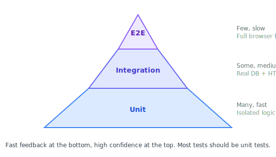

# Testing

> **[中文版](testing.zh.md)**

## Why We Test

Tests aren't busywork. They serve three purposes:

1. **Safety net for refactoring** — when you change how something works internally, tests tell you whether it still *behaves* correctly. Without tests, nobody dares refactor because they can't tell if they broke something.
2. **Regression prevention** — a bug you fixed stays fixed. The test that reproduces it ensures it never comes back silently.
3. **Living documentation** — test names describe what the code is supposed to do. When you read `test('returns 401 when token is expired')`, you understand the expected behavior without reading the implementation.

SynCode requires **≥ 80% statement coverage** for all backend code, enforced by SonarCloud's default quality gate in CI. Frontend (`apps/web`) coverage is excluded from SonarCloud. But coverage alone doesn't mean quality — read the [best practices](#testing-best-practices) section to understand what makes a test actually useful.

## The Testing Pyramid

<p align="center">
  
</p>

**Why pyramid-shaped?** Fast feedback at the bottom, high confidence at the top. Unit tests catch most bugs quickly and cheaply. Integration tests verify components work together. E2E tests confirm the whole system works but are slow and brittle — you want as few as necessary.

The ratio matters: if most of your tests are E2E, your test suite takes forever and breaks constantly. If you only have unit tests, you might miss issues in how components connect.

## Behavioral Testing — Test What, Not How

This is the single most important testing principle. Get this right and your tests become a lasting asset. Get it wrong and they become a burden.

### The Idea

Tests should describe **behavior** (what the code does from the outside) not **implementation** (how it does it internally).

- **Behavior:** "When a user logs in with valid credentials, they receive JWT tokens"
- **Implementation:** "The service calls `findByEmail`, then `bcrypt.compare`, then `jwt.sign`"

### Why This Matters

If you test implementation details, every refactor breaks your tests — even when nothing is actually broken. You rename an internal method? Tests fail. You add a caching layer? Tests fail. You change the order of two independent operations? Tests fail. Eventually, your tests become a tax on every change instead of a safety net.

Behavioral tests survive refactoring because they only care about **inputs and outputs**, not the path between them.

### The GIVEN-WHEN-THEN Pattern

Structure tests as specifications:

- **GIVEN** — the starting state (preconditions)
- **WHEN** — the action being tested
- **THEN** — the expected outcome

Our circuit breaker tests already use this convention:

```typescript
// packages/infrastructure/src/circuit-breaker/__tests__/circuit-breaker.spec.ts

test('GIVEN circuit is CLOSED WHEN failures reach threshold THEN transitions to OPEN', async () => {
  // GIVEN — circuit starts in CLOSED state (default)
  const failingFn = async () => { throw new Error('Service down'); };
  const config = { name: 'test-circuit', failureThreshold: 3, resetTimeoutMs: 10000 };

  // WHEN — we cause 3 failures (the threshold)
  for (let i = 0; i < 3; i++) {
    await expect(circuitBreaker.execute(failingFn, config)).rejects.toThrow('Service down');
  }

  // THEN — circuit transitions to OPEN
  const stats = circuitBreaker.getStats('test-circuit');
  expect(stats?.state).toBe(CircuitState.OPEN);
  expect(stats?.failureCount).toBe(3);
});
```

Notice: this test doesn't care *how* the circuit breaker tracks failures internally. It only checks the observable outcome — the state changed and the count is correct.

### Good vs. Bad Tests — A Concrete Example

Imagine testing `AuthService.login()`:

**Bad — tests implementation:**

```typescript
test('login calls the right methods', async () => {
  await authService.login({ email: 'test@example.com', password: 'secret123' });

  // These assertions couple the test to internal method names and call order
  expect(userRepo.findByEmail).toHaveBeenCalledWith('test@example.com');
  expect(bcrypt.compare).toHaveBeenCalledWith('secret123', user.passwordHash);
  expect(jwtService.sign).toHaveBeenCalledWith({ sub: user.id });
});
```

This test breaks if you:
- Rename `findByEmail` to `findByCredential`
- Add a caching layer before the database lookup
- Change from bcrypt to argon2
- Restructure the JWT payload

None of these changes break the *behavior* (valid login → tokens), but they all break the *test*.

**Good — tests behavior:**

```typescript
test('GIVEN a registered user WHEN logging in with correct password THEN returns valid tokens', async () => {
  // GIVEN
  const user = await createTestUser({ email: 'test@example.com', password: 'secret123' });

  // WHEN
  const result = await authService.login({ email: 'test@example.com', password: 'secret123' });

  // THEN
  expect(result.accessToken).toBeDefined();
  expect(result.refreshToken).toBeDefined();
});

test('GIVEN a registered user WHEN logging in with wrong password THEN throws UnauthorizedException', async () => {
  // GIVEN
  await createTestUser({ email: 'test@example.com', password: 'secret123' });

  // WHEN / THEN
  await expect(
    authService.login({ email: 'test@example.com', password: 'wrong' })
  ).rejects.toThrow(UnauthorizedException);
});
```

These tests survive any internal refactoring. They only break when the actual behavior changes — which is exactly when you *want* to know.

### What to Assert

- **Outputs and return values** — the direct result of calling a function
- **Side effects visible to the caller** — a new record in the database, a job in the queue, an event emitted
- **Error conditions** — the right exception is thrown with the right status code

**Don't assert:**
- Internal method calls (use `toHaveBeenCalledWith` sparingly — only when the side effect *is* the behavior, like verifying an email was sent)
- Order of operations (unless ordering is the actual requirement)
- Private state or internal data structures

## How Hexagonal Architecture Makes Testing Easy

This is the architectural payoff. If you've read the [architecture docs](architecture.md#hexagonal-architecture-ports-and-adapters), you know SynCode uses ports and adapters. Here's why that directly enables fast, reliable testing.

### The Problem Without Ports

If your service directly imports concrete implementations:

```typescript
import { BullMqAdapter } from '@syncode/infrastructure';
import { RedisCacheAdapter } from '@syncode/infrastructure';

class ExecutionService {
  constructor(
    private queue = new BullMqAdapter({ url: 'redis://localhost:6379' }),
    private cache = new RedisCacheAdapter({ url: 'redis://localhost:6379' }),
  ) {}
}
```

To test this service, you need a running Redis server. Tests become slow (network calls), flaky (what if Redis is down?), and require complex setup (Docker in CI).

### The Solution With Ports

Your service depends on *interfaces*, not implementations:

```typescript
class ExecutionService {
  constructor(
    @Inject(QUEUE_SERVICE) private queue: IQueueService,
    @Inject(CACHE_SERVICE) private cache: ICacheService,
  ) {}
}
```

In tests, you inject lightweight fakes:

```typescript
const module = await Test.createTestingModule({
  providers: [
    ExecutionService,
    {
      provide: QUEUE_SERVICE,
      useValue: {
        enqueue: vi.fn().mockResolvedValue({ id: 'job-123' }),
        // ... only mock what this test needs
      },
    },
    {
      provide: CACHE_SERVICE,
      useValue: {
        get: vi.fn().mockResolvedValue(null),
        set: vi.fn().mockResolvedValue(undefined),
      },
    },
  ],
}).compile();
```

No Redis needed. No Docker. No network calls. Tests run in milliseconds.

```
Production:  ExecutionService → @Inject(QUEUE_SERVICE) → BullMqAdapter → Redis
Unit test:   ExecutionService → @Inject(QUEUE_SERVICE) → { enqueue: vi.fn() }
```

### This Is Why We Have the Architecture

The hexagonal pattern isn't "clean code" for its own sake. It directly enables:

- **Fast unit tests** — no infrastructure dependencies
- **Reliable tests** — no flaky network calls
- **Focused tests** — mock only what you need, test only what matters

The stubs (`StubExecutionClient`, `StubAiClient`, `StubCollabClient`) are the same idea applied at the plane level — they're test doubles that also work at runtime.

## Unit Testing in SynCode

### Tools

| Tool | Purpose |
|---|---|
| [Vitest](https://vitest.dev/) | Test runner + assertions (`describe`, `test`, `expect`) |
| [unplugin-swc](https://github.com/nicepkg/unplugin-swc) | NestJS decorator support in Vitest (replaces TypeScript's `emitDecoratorMetadata`) |
| [@nestjs/testing](https://docs.nestjs.com/fundamentals/testing) | Creates test modules with mock providers |

### Where Tests Live

Two conventions — pick one and be consistent within a module:

```
modules/auth/
  auth.service.ts
  auth.service.spec.ts       ← Option A: alongside the source file
  __tests__/
    auth.service.spec.ts     ← Option B: in a __tests__ subfolder
```

The circuit breaker package uses Option B. Either works.

### Testing a NestJS Service — Step by Step

Here's a skeleton for testing a service that depends on injected ports:

```typescript
import { Test } from '@nestjs/testing';
import { describe, test, expect, beforeEach, vi } from 'vitest';
import { CACHE_SERVICE, type ICacheService } from '@syncode/shared/ports';
import { RoomsService } from './rooms.service';

describe('RoomsService', () => {
  let service: RoomsService;
  let mockCache: ICacheService;

  beforeEach(async () => {
    // Create mock implementations
    mockCache = {
      get: vi.fn(),
      set: vi.fn(),
      delete: vi.fn(),
      shutdown: vi.fn(),
    };

    // Build a test module with mock providers
    const module = await Test.createTestingModule({
      providers: [
        RoomsService,
        { provide: CACHE_SERVICE, useValue: mockCache },
        // ... other dependencies
      ],
    }).compile();

    service = module.get(RoomsService);
  });

  test('GIVEN a valid room config WHEN creating a room THEN returns the room ID', async () => {
    // GIVEN
    const config = { name: 'Interview Room', language: 'python' };

    // WHEN
    const result = await service.createRoom(config);

    // THEN
    expect(result.id).toBeDefined();
    expect(result.name).toBe('Interview Room');
  });
});
```

### Mocking with Vitest

| Function | When to Use |
|---|---|
| `vi.fn()` | Create a mock function from scratch |
| `vi.fn().mockResolvedValue(x)` | Mock an async function that resolves to `x` |
| `vi.fn().mockRejectedValue(err)` | Mock an async function that rejects with `err` |
| `vi.spyOn(obj, 'method')` | Spy on an existing method (preserves original by default) |

```typescript
// Mock that returns different values on successive calls
const mockGet = vi.fn()
  .mockResolvedValueOnce(null)        // first call: cache miss
  .mockResolvedValueOnce({ id: 1 });  // second call: cache hit

// Verify a mock was called (only when the call IS the behavior)
expect(mockCache.set).toHaveBeenCalledWith('room:123', expect.any(Object));
```

### What to Unit Test

| What | Test? | Why |
|---|---|---|
| Service methods | **Yes** | This is your business logic — the core of the app |
| Guards, interceptors, pipes | **If complex** | Only when they contain non-trivial logic |
| Utility functions (`packages/shared/`) | **Yes** | Shared code used everywhere — must be reliable |
| DTOs | **No** | They're just shapes. Zod validates at runtime. |
| Controllers | **Usually no** | They're thin wrappers. Test via integration tests instead. |
| Module files | **No** | Just wiring — NestJS handles it. |

### Running Tests

```bash
pnpm test                                          # All workspaces
cd apps/control-plane && pnpm test                 # Single app
cd apps/control-plane && vitest run src/modules/auth  # Single module
cd apps/control-plane && vitest watch              # Watch mode (re-runs on save)
```

## Integration Testing

Integration tests verify that multiple components work together with real infrastructure. They catch issues that unit tests miss: SQL queries that don't work, serialization bugs, middleware ordering, guard behavior.

### Tools

| Tool | Purpose |
|---|---|
| Vitest | Test runner (same as unit tests) |
| [supertest](https://github.com/ladjs/supertest) | Send real HTTP requests to your NestJS app in tests |
| [Testcontainers](https://testcontainers.com/) | Spin up disposable Docker containers (PostgreSQL, Redis) for tests |

### How Testcontainers Works

Before your test suite runs, Testcontainers starts a real PostgreSQL container with a random port. Your tests get a connection string to a real, isolated database. After tests finish, the container is destroyed. Every test run starts completely fresh.

This eliminates "works on my machine" issues from different local data, and gives you confidence that your SQL queries and migrations actually work.

> **Status:** Testcontainers is not installed yet. The infrastructure is ready for it — `supertest` is already a devDependency in `apps/control-plane`, and `@nestjs/testing` is available in all NestJS apps. When we add it, the setup will look like:

```typescript
import { PostgreSqlContainer } from '@testcontainers/postgresql';
import { beforeAll, afterAll } from 'vitest';

let container: StartedPostgreSqlContainer;

beforeAll(async () => {
  // Starts a real PostgreSQL container (takes ~2-5 seconds)
  container = await new PostgreSqlContainer().start();
  process.env.DATABASE_URL = container.getConnectionUri();
  // Run migrations against the test database
  await runMigrations();
}, 30_000); // 30s timeout for container startup

afterAll(async () => {
  await container.stop(); // Container destroyed — clean slate
});
```

### Testing a Controller with supertest

```typescript
import { Test } from '@nestjs/testing';
import request from 'supertest';
import { describe, test, expect, beforeAll } from 'vitest';
import { AppModule } from '@/app.module';

describe('Auth Controller (integration)', () => {
  let app: INestApplication;

  beforeAll(async () => {
    const module = await Test.createTestingModule({
      imports: [AppModule],
    }).compile();

    app = module.createNestApplication();
    await app.init();
  });

  test('GIVEN valid registration data WHEN posting to /auth/register THEN returns 201 with tokens', async () => {
    // WHEN
    const response = await request(app.getHttpServer())
      .post('/auth/register')
      .send({ email: 'new@example.com', password: 'validpassword123', name: 'Test User' });

    // THEN
    expect(response.status).toBe(201);
    expect(response.body).toHaveProperty('accessToken');
  });

  test('GIVEN an invalid email WHEN posting to /auth/register THEN returns 400', async () => {
    // WHEN
    const response = await request(app.getHttpServer())
      .post('/auth/register')
      .send({ email: 'not-an-email', password: 'validpassword123' });

    // THEN
    expect(response.status).toBe(400);
  });
});
```

### What to Integration Test

- **Auth flows** — register → login → access protected route → refresh token
- **CRUD operations** — create → read → update → delete, verifying database state
- **Error cases** — invalid input (400), unauthorized (401), not found (404)
- **Middleware and guards** — verify that authentication actually blocks unauthorized requests

Don't test every edge case at this level — that's what unit tests are for. Integration tests verify the *wiring* between components works.

## E2E Testing

E2E tests verify the full system through a real browser — the closest thing to a human manually testing the app.

### Tools

| Tool | Purpose |
|---|---|
| [Playwright](https://playwright.dev/) | Browser automation — navigates pages, clicks buttons, fills forms, asserts on screen content |

> **Status:** The `e2e/` directory exists but is empty. Playwright is not installed yet.

### What E2E Tests Cover

Critical user journeys only:

- Can a user sign up, log in, and see their dashboard?
- Can a user create a room, join it, and see the editor?
- Can a user write code and run it?

These are your "smoke tests" — if they pass, the whole system is fundamentally working.

### How Playwright Works

Playwright launches a real browser, navigates to your app, and interacts with it like a user:

```typescript
import { test, expect } from '@playwright/test';

test('GIVEN a registered user WHEN logging in with valid credentials THEN shows the dashboard', async ({ page }) => {
  // WHEN
  await page.goto('http://localhost:5173/login');
  await page.getByLabel('Email').fill('test@example.com');
  await page.getByLabel('Password').fill('secret123');
  await page.getByRole('button', { name: 'Log in' }).click();

  // THEN
  await expect(page.getByText('Dashboard')).toBeVisible();
});
```

### Best Practices for E2E Tests

- **Test happy paths and critical error paths only** — don't try to cover every edge case. E2E tests are slow and expensive to maintain.
- **Use `data-testid` attributes** for reliable element selection. CSS classes change with styling; test IDs don't: `<button data-testid="submit-code">Run</button>` → `page.getByTestId('submit-code')`.
- **Keep tests independent** — each test sets up its own data (via API calls in `beforeEach`), never depends on another test's state.
- **Don't test what's already covered** — if you have unit tests for form validation, you don't need E2E tests for every invalid input.

## Testing Best Practices

These apply to all test levels.

### Write Tests First When Fixing Bugs

Before writing the fix, write a test that reproduces the bug. Run it — it should fail. Then write the fix. Run the test again — it should pass. Now the bug can never come back silently. This is the most practical application of "test-driven development" and it works every time.

### One Assertion per Behavior

Each test should verify one thing. Test names should read like specifications:

```typescript
// Bad — multiple behaviors in one test
test('user registration', async () => {
  const result = await authService.register(validData);
  expect(result.id).toBeDefined();
  expect(result.email).toBe('test@example.com');
  expect(mockEmailService.send).toHaveBeenCalled();
  expect(mockCache.set).toHaveBeenCalledWith(`user:${result.id}`, expect.any(Object));
});

// Good — each behavior gets its own test
test('GIVEN valid data WHEN registering THEN creates user with correct email', ...);
test('GIVEN valid data WHEN registering THEN sends welcome email', ...);
test('GIVEN valid data WHEN registering THEN caches the new user', ...);
```

When a test with one assertion fails, you know *exactly* what broke. When a test with five assertions fails, you have to investigate.

### Don't Test the Framework

NestJS's dependency injection works. Drizzle's query builder works. Vitest's mocking works. Test **your** logic, not theirs.

```typescript
// Bad — testing that NestJS DI works
test('service is defined', () => {
  expect(service).toBeDefined();
});

// Bad — testing that Drizzle generates correct SQL
test('query uses WHERE clause', () => {
  expect(query.toSQL()).toContain('WHERE');
});
```

These tests tell you nothing useful and will never fail (unless you misconfigured the test setup, which is a different problem).

### Use Descriptive Test Names

Test names are documentation. Someone reading the test output should understand the expected behavior:

```typescript
// Bad
test('auth test 3', ...);
test('should work', ...);
test('error case', ...);

// Good
test('returns 401 when JWT token is expired', ...);
test('GIVEN no rooms WHEN listing rooms THEN returns empty array', ...);
test('rejects passwords shorter than 8 characters', ...);
```

### Arrange-Act-Assert (AAA)

Structure every test into three clear sections. This is the same idea as GIVEN-WHEN-THEN:

```typescript
test('GIVEN cached data WHEN fetching room THEN returns from cache without DB query', async () => {
  // Arrange (GIVEN)
  const cachedRoom = { id: '123', name: 'Test Room' };
  mockCache.get.mockResolvedValue(cachedRoom);

  // Act (WHEN)
  const result = await service.getRoom('123');

  // Assert (THEN)
  expect(result).toEqual(cachedRoom);
  expect(mockDb.query).not.toHaveBeenCalled();
});
```

### Keep Tests Fast

A unit test should run in under 100ms. If it takes longer, something is wrong — you're probably making real network calls, hitting a real database, or doing actual cryptographic work. Mock those dependencies.

Your entire unit test suite should run in under 30 seconds. Fast tests get run often. Slow tests get ignored.

### Don't Mock What You Don't Own

Be cautious about mocking third-party libraries. If you mock `bcrypt.compare` to always return `true`, your test can't tell you if you're using bcrypt incorrectly. Instead:

- For simple, fast libraries (bcrypt, zod, uuid): use the real implementation
- For slow or external services (HTTP clients, databases): mock them or use Testcontainers
- For our port interfaces: mock them — they're *designed* to be swapped

### Test the Public API, Not Private Methods

If a private method is complex enough that you feel it needs its own tests, that's a signal: extract it into its own function or class with a public API, then test that.

```typescript
// Bad — testing a private method directly
test('_hashPassword uses bcrypt with cost 12', () => {
  const hash = service['_hashPassword']('secret');  // accessing private method
  // ...
});

// Good — test the public behavior that uses the private method
test('GIVEN a valid password WHEN registering THEN stores a hashed password (not plaintext)', async () => {
  await service.register({ email: 'test@example.com', password: 'secret123' });
  const user = await getTestUser('test@example.com');
  expect(user.passwordHash).not.toBe('secret123');
});
```

### Coverage Is a Compass, Not a Target

80% coverage doesn't mean your code is well-tested. A single test that calls every function but checks nothing achieves high coverage with zero confidence:

```typescript
// Achieves 100% coverage. Tests absolutely nothing.
test('covers everything', async () => {
  await service.register(validData);
  await service.login(validData);
  await service.refreshToken(token);
  await service.logout(token);
  // no assertions!
});
```

Use coverage as a **compass** — it shows you which code *isn't* tested. But the quality of your tests comes from meaningful assertions, not from coverage numbers.

## Test Commands Reference

| Command | What It Does |
|---|---|
| `pnpm test` | Run all tests across all workspaces |
| `pnpm test:cov` | Run all tests with coverage reports |
| `cd apps/control-plane && pnpm test` | Run tests for a single app |
| `cd apps/control-plane && vitest run src/modules/auth` | Run tests for a single module |
| `cd apps/control-plane && vitest watch` | Watch mode — re-runs on file change |
| `cd packages/infrastructure && pnpm test:watch` | Watch mode for infrastructure package |

Coverage reports are generated in each workspace's `coverage/` directory. Open `coverage/index.html` in a browser for a visual report showing which lines are covered.
